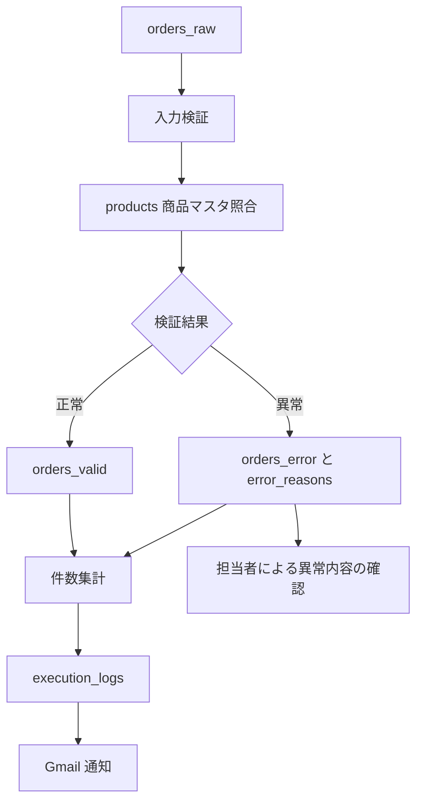
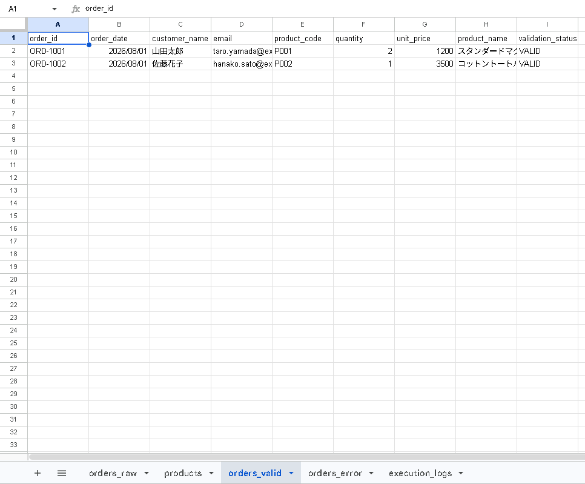
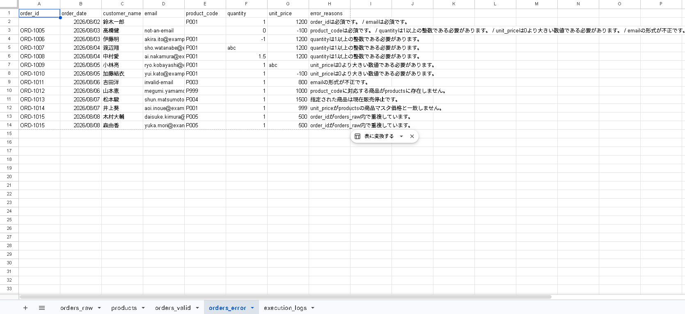
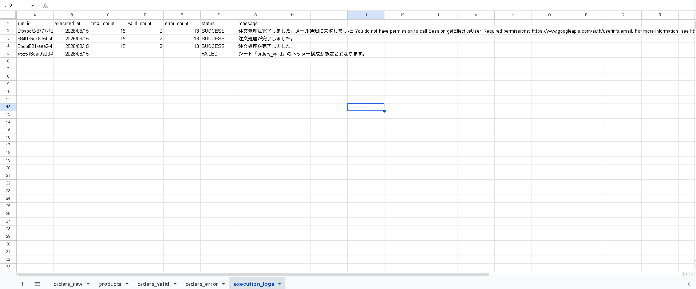
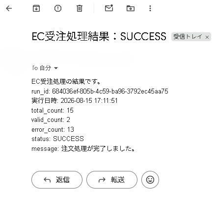

# EC受注業務自動化ミニシステム（GAS）

> 架空のEC事業者における受注CSV確認業務を、Google SheetsとGoogle Apps Scriptで支援するポートフォリオです。実案件・有償実績ではありません。

## 成果の要約

- サンプル注文 **15件**を処理し、**正常2件／異常13件**へ分類
- 入力値と商品マスタを照合し、異常理由を行ごとに記録
- `SUCCESS` / `FAILED`の実行ログと、集計だけを載せたGmail通知を実装
- 想定外のシート構造では、無理に上書きせず処理を停止
- AI支援で実装し、別スレッドのCodex Reviewerによる独立レビューと人間によるGoogle Apps Script実環境確認を行った

## 1. プロジェクト概要

手作業での受注CSV確認を想定した、Google Sheets + Google Apps Script（GAS）のポートフォリオです。完全在宅のGAS案件、業務改善案件、Web/IT求人への応募時に、業務フローの理解と安全性を意識した実装例として提示することを想定しています。

実顧客・実注文は使用しておらず、すべて架空のデータです。

## 2. 想定する業務課題（As-Is）

```
注文CSV → 目視確認 → 商品マスタを手動検索 → 入力・価格を確認
       → 正常／異常を手作業で分類 → 結果を共有
```

想定する課題は、確認漏れ、担当者ごとの判定ぶれ、商品マスタ照合の手間、エラー理由の整理、処理履歴の残りにくさです。工数削減時間や効率化率は測定していないため記載していません。

## 3. 自動化後の処理フロー（To-Be）



## 4. 主な機能

- 必須項目、`order_id`重複、数量、単価、メール形式の検証
- 商品コードの存在、販売可否（`active`）、注文単価とマスタ単価の照合
- 正常データの`orders_valid`、異常データと複数理由の`orders_error`への分離
- total / valid / error件数の集計、`run_id`の生成、`execution_logs`への記録
- 実行ユーザーへのGmail通知（集計情報のみ）
- 商品マスタの重複コード、重複ヘッダー、不正な出力／ログ構成の検出と安全停止

## 5. シート構成

| シート | 用途 | 主な列 |
| --- | --- | --- |
| `orders_raw` | 入力注文 | order_id, order_date, customer_name, email, product_code, quantity, unit_price |
| `products` | 商品マスタ | product_code, product_name, unit_price, active |
| `orders_valid` | 正常結果 | 元注文列 + product_name, validation_status |
| `orders_error` | 異常結果 | 元注文列 + error_reasons |
| `execution_logs` | 実行履歴 | run_id, executed_at, total_count, valid_count, error_count, status, message |

`orders_valid`と`orders_error`はシステム管理専用です。ヘッダー名・順序・重複・想定外の非空列を事前に検証し、不正なら書込み前に停止します。

## 6. 入力データ仕様

### orders_raw

`order_id`、`order_date`、`customer_name`、`email`、`product_code`、`quantity`、`unit_price`の7項目が必須です。`order_date`は必須チェックのみで、日付形式の厳密な検証はv1の対象外です。完全な空行は処理対象にしません。

### products

`product_code`、`product_name`、`unit_price`、`active`を持つ商品マスタです。空または重複した`product_code`は、処理を続けると誤判定につながるためFAILEDとして停止します。

## 7. バリデーション仕様

| 対象 | 確認内容 |
| --- | --- |
| 必須項目 | 7項目の空欄を検出 |
| order_id | orders_raw内の重複を検出し、該当する全行を異常扱い |
| quantity | 数値、整数、1以上 |
| unit_price | 数値、0より大きい値 |
| email | 一般的な入力ミスを検出する基本形式 |
| 商品マスタ | 商品存在、`active`、単価の完全一致 |

単価照合はv1では単純な数値の完全一致です。セール、クーポン、価格改定などを考慮する価格ルールは未実装です。

## 8. 正常系・異常系の例

サンプルCSVの期待値は、`total_count = 15`、`valid_count = 2`、`error_count = 13`です。正常注文は`ORD-1001`と`ORD-1002`です。

| 注文 | 代表的な確認内容 |
| --- | --- |
| `ORD-1005` | 必須項目、quantity、unit_price、emailの複数エラー |
| `ORD-1012` | 存在しない商品コード |
| `ORD-1013` | 販売停止商品 |
| `ORD-1014` | 商品マスタとの価格不一致 |
| `ORD-1015` | 重複order_idの2行とも異常 |

> 正常と判定された注文は`orders_valid`へ出力し、商品名と`VALID`を付与します。



> 異常注文は除外するのではなく、元データと確認可能な理由を`orders_error`へ出力します。



詳細は[sample-data/expected-results.md](sample-data/expected-results.md)を参照してください。

## 9. テスト・QA

### ローカル／静的・モック確認

Codexローカル環境で、ソース構文、サンプルCSVの期待値、各バリデーション、再実行時の出力置換を確認しました。さらに、ヘッダー・ログ・出力保護について17件のインメモリモック確認を行い、次を確認しました。

- サンプル結果が正常2件／異常13件となること
- 重複`ORD-1015`と`ORD-1005`の複数エラーを扱えること
- 出力ヘッダー異常時は書込み前にFAILEDとなること
- `execution_logs`の固定列順、旧3列ログの安全な移行条件、再実行時のログ／通知増加

これはGoogle Apps Script実行環境そのものではなく、ローカルの静的・モック確認です。

### 人間による実Google Apps Script確認

Google Apps Script上で、以下を人間が確認済みです。

- `initializeSheets()`の成功、サンプル15件の処理、正常2件／異常13件
- 再実行しても`orders_valid`／`orders_error`が無制限に増殖しないこと
- 旧3列の`execution_logs`から新7列形式への移行、SUCCESSログ、SUCCESS Gmail通知
- Gmail権限不足時に、注文処理と通知失敗を区別すること
- 想定外の`orders_valid`ヘッダーでFAILEDとなり、既存出力を無条件に消去しないこと
- FAILEDログとFAILED Gmail通知

すべての異常系を実GAS環境で網羅試験したものではありません。

## 10. データを壊さないための設計

- 出力前に、入力・商品・出力・ログのシート構造を検証
- 重複ヘッダー、出力シートの順序違い、想定外の非空列を拒否
- `clearContent()`の範囲をシステム管理列に限定し、未知の列を消去しない
- `execution_logs`は固定の7列構成を要求し、旧3列形式は空の正規構成だけを移行
- 例外を成功扱いにせず、可能な範囲でFAILEDログと通知を残す

## 11. 人間判断を残す部分

異常注文を自動修正しません。元データと`error_reasons`を`orders_error`へ出力し、担当者が内容を確認します。

| 自動化する処理 | 人間が判断する処理 |
| --- | --- |
| 形式チェック、商品マスタ照合、振り分け、集計、通知、ログ | 異常注文の確認、修正可否、セール・価格例外などの業務判断 |

## 12. 再実行時の挙動

| 対象 | 挙動 |
| --- | --- |
| `orders_valid` / `orders_error` | 今回の結果へ置換 |
| `execution_logs` | 実行ごとに1行追加 |
| Gmail | 実行ごとに集計通知を再送 |

過去注文を含む完全な二重処理防止や完全な冪等性は、v1では未実装です。

## 13. Gmail通知と実行ログ

`SUCCESS`は振り分け結果まで作成できた状態、`FAILED`はシート不足・不正ヘッダー・商品マスタ不整合などで正常な処理を保証できない状態です。通知本文にはrun_id、実行日時、集計値、status、messageだけを含め、顧客の氏名・メールアドレス・注文内容は載せません。

メール通知だけが失敗・スキップされた場合は、注文処理をFAILEDへ変更せず、SUCCESSログのmessageへ理由を記録します。

> 処理ごとの件数と、SUCCESS／FAILEDの状態を`execution_logs`へ残します。



> 処理完了後は、顧客情報を含めず集計結果だけを実行ユーザーへ通知します。



## 14. 技術・実装上のポイント

| 技術 | 利用目的 |
| --- | --- |
| SpreadsheetApp / `getValues` / `setValues` | シート入出力を配列でまとめ、1行ごとのAPI呼出しを避ける |
| Map | 商品コードから商品マスタを参照し、重複コードも検出する |
| Set | 重複した注文IDの集合を表現する |
| try/catch | 例外をFAILEDとして扱い、原因を隠さない |
| GmailApp / Session | 実行ユーザーへ集計だけを通知する |
| Utilities.getUuid() | 実行単位を識別するrun_idを生成する |
| clasp | ローカルの`.gs`と既存GASプロジェクトを安全に同期する |

## 15. AIを利用した開発工程

このプロジェクトではChatGPT / Codex等のAI支援を利用しています。AI出力を無条件に採用するのではなく、次の工程で確認しました。

```text
人間による方針・最終承認
  → ChatGPTによる要件整理・設計・作業分解
  → Codex Builderによる実装
  → 別Codex Reviewerによる独立レビュー
  → Builder修正・Reviewer再確認
  → claspで既存Apps Scriptプロジェクトとの接続・同期状態を確認
  → 人間による実Google Apps Script確認
```

独立レビューでは、想定外列の消去、execution_logsの列ずれ、旧ログ移行時の上書き、重複ヘッダーの扱いを問題として検出しました。修正後に再確認を行っています。AIを補助として使い、レビューと実環境確認を挟んだ点が本プロジェクトの開発工程です。

## 16. AI・個人情報・セキュリティ

サンプルには架空データと`example.com`を使用しています。実顧客の個人情報、注文情報、パスワード、APIキー、OAuthトークン、顧客機密情報、許可のない非公開ソースコードを外部AIへ入力しないでください。READMEやコードへも秘密情報を記載しません。

## 17. 開発・試用手順

### 手動で試す場合

1. テスト用のGoogle SpreadsheetでApps Scriptを開く
2. 各`.gs`ファイルをApps Script上に同名のスクリプトファイルとして作成し、内容を貼り付けて保存した後、`initializeSheets()`を実行する
3. `sample-data/products.csv`と`sample-data/orders_raw.csv`を各シートへ取り込む
4. `processOrders()`を実行し、正常2件／異常13件を確認する

### ローカル開発

claspで既存のGASプロジェクトへ接続しています。ローカルを開発上の正本とし、Apps Scriptエディタとローカルを同時に編集しません。

1. 変更後にレビュー・確認を行う
2. `clasp show-file-status`で同期対象を確認する
3. 人間が内容を確認したうえで`clasp push`を実行する

リモートを直接編集した場合のみ、ローカル変更を確認・退避してから慎重に`clasp pull`を使用します。`.clasp.json`は接続設定のみを保持し、認証トークンはプロジェクトへ保存しません。PowerShellの実行ポリシーで必要な場合は`clasp.cmd`を使用します。

## 18. Before / After

| Before | After |
| --- | --- |
| CSV確認 → 商品検索 → 入力チェック → 正常／異常分類 → 集計 → 共有 | CSV投入 → `processOrders()` → 自動検証・商品照合 → valid/error分離 → ログ・集計・通知 → 異常データを人間が確認 |

## 19. 今後の改善候補

v1の範囲外として、優先度の高い候補を分離しています。

- LockServiceによる同時実行対策
- 大量データでの性能・上限試験
- 自動テストの整備
- 過去注文を含む二重処理防止と完全な冪等性
- セール・クーポン・価格改定を考慮した価格ルール

## ディレクトリ構成

```text
.
├─ Config.gs
├─ Setup.gs
├─ Main.gs
├─ Validation.gs
├─ SheetUtils.gs
├─ appsscript.json
├─ .clasp.json
├─ README.md
└─ sample-data/
   ├─ products.csv
   ├─ orders_raw.csv
   └─ expected-results.md
```
